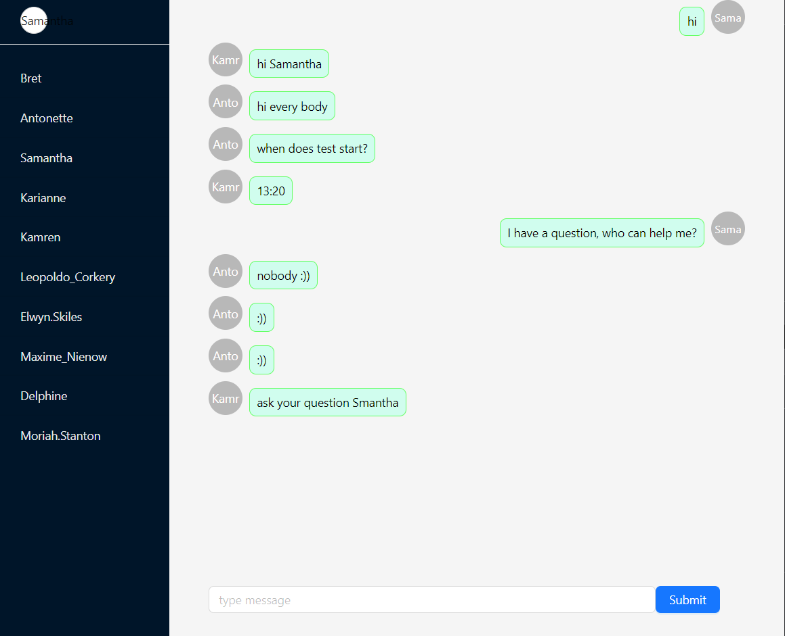

## How to run project?

0- Get clone from project

1-In the project frontend directory, run:

### `npm install`
### `npm run build`
2-In the project backend directory, run:

### `npm install`

3-In the project root directory, run:
### `npm install`
### `npm start`

preview:
